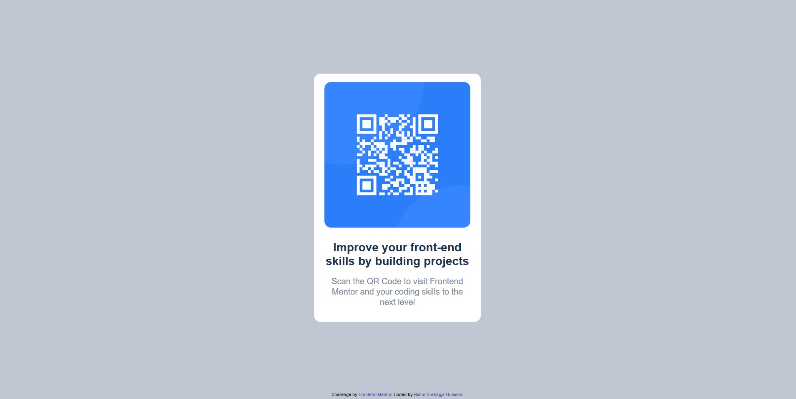
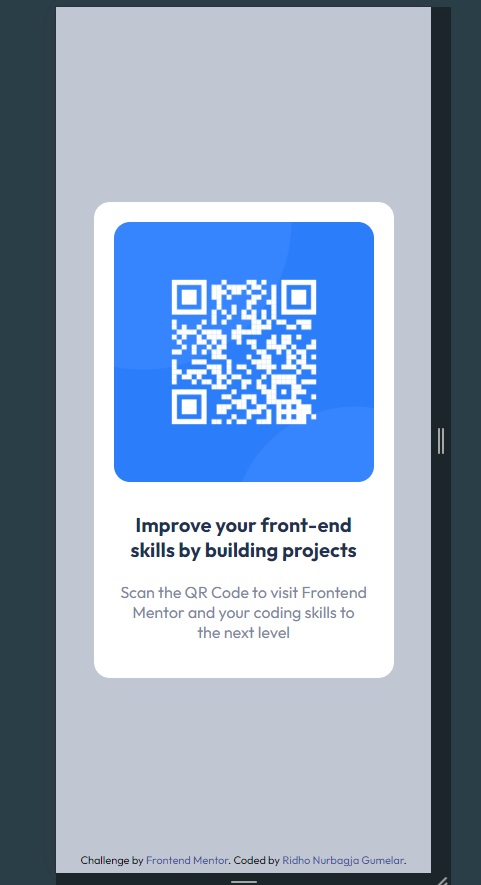

## Table of contents

- [Overview](#overview)
  - [Screenshot](#screenshot)
  - [Links](#links)
- [My process](#my-process)
  - [Built with](#built-with)
  - [Continued development](#continued-development)
  - [Useful resources](#useful-resources)
- [Author](#author)

## Overview

QR Code component project. This is the final design for completing the Front-End Mentor Challenge. Sorry for my bad English ^\_^

### Screenshot

Desktop Design.

Mobile Design.

### Links

- Live Site URL: [Add live site URL here](https://your-live-site-url.com)

## My process

Im starting this project with the starter file provided by frontendmentor. and then I'm writing the HTML code first to add the necessary things. After that i add external stylesheet with style.css

### Built with

- Semantic HTML5 markup
- Flexbox

### Continued development

In the future maybe I will develop this a bit further or use this component for other project.

## Author

- Frontend Mentor - [@yourusername](https://www.frontendmentor.io/profile/ridhonurbagjag)
- Github - [@yourusername](https://github.com/ridhonurbagjag)
